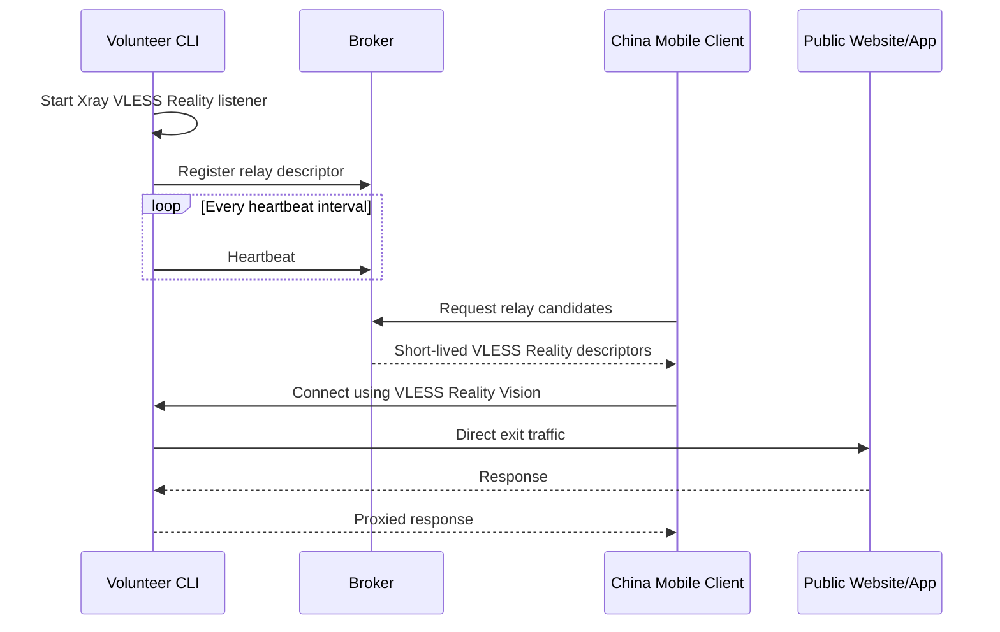

# Architecture

## Goals

Typhoon provides temporary volunteer relays outside China so mobile clients inside China can reach blocked public websites and apps.

The MVP optimizes for learning:

- Require each volunteer to expose a public reachable TCP port.
- Use Xray-core for VLESS + Reality + Vision transport.
- Keep the broker out of the data path.
- Let the mobile client route all device traffic through a VPN tunnel.

## Components

### Broker

The broker is a control-plane service. It stores short-lived relay descriptors and returns candidates to clients.

The broker does not:

- Proxy user traffic.
- Store browsing destinations.
- Terminate VLESS sessions.
- Know client traffic contents.

The broker does:

- Accept volunteer registration.
- Track volunteer heartbeats.
- Expire stale volunteers.
- Return a small candidate set to clients.

### Volunteer CLI

The volunteer CLI runs on desktop systems. For MVP it starts an Xray-core inbound listener and registers the relay with the broker.

The CLI produces an Xray server config with:

- VLESS inbound.
- Reality transport.
- Vision flow: `xtls-rprx-vision`.
- Freedom outbound, meaning the volunteer is the direct exit.

### Mobile Client

The China client is an iOS/Android app using VPN mode. It asks the broker for relay candidates, configures a compatible VLESS Reality client, and routes device traffic through the selected volunteer.

Implementation detail for later:

- Android can use `VpnService` plus a userspace TCP/UDP stack or tun2socks bridge.
- iOS can use `NetworkExtension` packet tunnel provider.

### Future Dedicated Exit Mode

In a later phase, volunteers should be able to choose one of two modes:

- Direct exit mode: volunteer connects directly to destination websites.
- Entry relay mode: volunteer accepts client traffic and routes it to a dedicated exit server.

Entry relay mode protects volunteers from being the destination-visible exit IP. The broker descriptor should therefore keep `exit_mode` as an explicit field from the start.

## MVP Data Flow

## Trust Boundaries

Volunteer relays are not inherently trusted. The client should treat each volunteer as a network provider:

- Use HTTPS/TLS to destination sites whenever possible.
- Avoid sending broker credentials to volunteers.
- Rotate relay credentials frequently.
- Prefer short-lived relay descriptors.

The broker should treat volunteer registrations as untrusted input:

- Require authentication for volunteers outside local development.
- Validate ports, hostnames, protocol fields, and advertised capabilities.
- Expire inactive relays aggressively.

The current scaffold advertises one generated VLESS client ID per volunteer process. That is acceptable for private MVP testing, but public versions should issue short-lived per-client credentials and push them into Xray dynamically.

## Open Design Decisions

- Public reachability probing: the broker should eventually verify the advertised endpoint from outside the volunteer network.
- Relay selection: start simple, then add health score, capacity, country, latency, and reputation.
- Abuse controls: add per-relay limits, destination policy, reporting, and blocklists before public rollout.
- Mobile engine: choose whether to embed a maintained Xray-compatible engine or call into a separate core.
